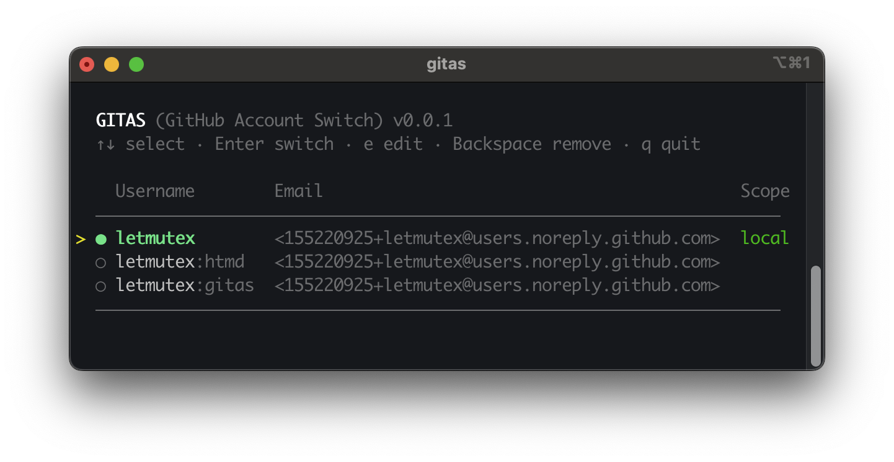

# gitas

Git Account Switch / Git As



## Installation

```bash
# Install Script (Linux & macOS)
curl -fsSL https://raw.githubusercontent.com/letmutex/gitas/main/install.sh | sh

# Install Script (Windows PowerShell)
irm https://raw.githubusercontent.com/letmutex/gitas/main/install.ps1 | iex

# Homebrew
brew tap letmutex/tap
brew install gitas

# Cargo
cargo install gitas
```

## Usage

```bash
# Open interactive TUI to switch, edit, or remove accounts
gitas

# Add a new account (Manual or GitHub Login)
gitas add

# Run any git command as a specific account
# Useful for cloning private projects
gitas git clone <url>
```

## How It Works

**Switching Identity**: Updates your local/global `git config` and pre-fills the credential cache, so subsequent git commands work seamlessly without prompts.

**Command Proxy (`gitas git`)**: Executes git with a temporary identity and credential helper using `-c` flags. It does **not** modify any config files, making it perfect for one-off commands.

**Secure Storage**: All tokens are stored in your system's native keychain (macOS Keychain, Windows Credential Manager, Linux Secret Service).

## Data

- **Config**: [`dirs::config_dir()`](https://docs.rs/dirs/latest/dirs/fn.config_dir.html)/`gitas/accounts.json`
- **Secrets**: System Keychain

## Uninstallation

```bash
# Linux / macOS (Install Script)
rm -rf ~/.gitas

# Windows (PowerShell Install Script)
Remove-Item -Path "$env:LOCALAPPDATA\gitas" -Recurse -Force

# Homebrew
brew uninstall gitas

# Cargo
cargo uninstall gitas
```

## License

This project is licensed under the [Apache License, Version 2.0](LICENSE).
